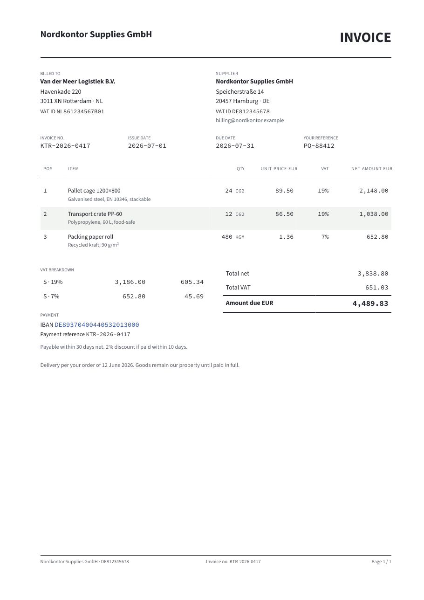
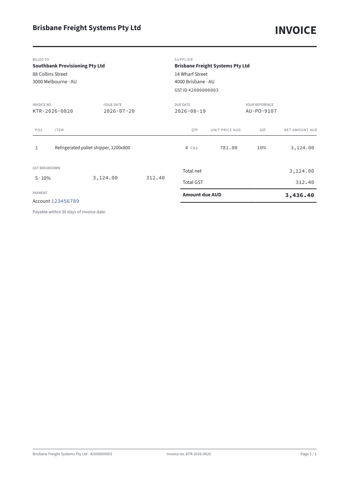

# Faktorei — EN 16931 e-invoice rendering stylesheets

Open-source XSLT 3.0 / XSL-FO stylesheets that turn structured electronic invoices
(Peppol BIS Billing 3.0, XRechnung, PINT A-NZ, and the Factur-X/ZUGFeRD CII
profile) into clean, print-ready PDF — validated 0-fatal/0-warning against the
**official** CEN, OpenPeppol, KoSIT and PINT Schematron, and tracked to the
semi-annual spec cycle.

The semantic model is EN 16931; the network is not. Peppol now carries millions
of participants across 100+ countries, so the corpus covers non-euro currencies
and non-EU jurisdictions as well as European ones.

| European (Peppol BIS, EUR, VAT) | Australian (PINT A-NZ, AUD, GST) |
|---|---|
|  |  |
| `corpus/fixtures/ubl/001-base-multivat.xml` | `corpus/fixtures/ubl/020-pint-aunz-gst.xml` |

*Same renderer, same theme, same code path — the profile is a parameter. Every PNG
under `corpus/baselines/` is a blessed render of a corpus fixture, byte-compared in
CI on every change.*

## How it works — one renderer, every syntax

A two-phase transform is the load-bearing decision:

```
UBL 2.1 ─┐
CII ─────┼─ normalize/*.xsl ──► semantic model ──► render/layout.xsl ──► XSL-FO ──► FOP ──► PDF
         │                     (EN 16931 BT-/BG-,       + blocks/*                (Apache FOP)
(syntax) ┘                      urn:faktorei:semantic)     + themes/*  + i18n/*
```

Normalizers map each input syntax onto **one** semantic vocabulary
(`stylesheets/semantic/model.md`); the renderer consumes only that. National
profiles are configuration deltas, not forks — there are two, **XRechnung**
(Germany) and **PINT A-NZ** (Australia / New Zealand), and they share every line
of rendering logic. Styling lives
exclusively in theme attribute-sets — the contract is the header of
`stylesheets/render/themes/ledger.xsl`; the public parameter surface is
`stylesheets/config/params.md`.

**Shipped today:** two label locales — **English and German** — and the **Ledger**
theme (the default; further themes are in development). Additional locales (French,
Dutch) are on the roadmap, not yet shipped.

Labels can be overridden per profile (`<key>@<profile>` in `i18n/labels-*.xml`),
because some wording is a *jurisdiction* property rather than a language one: the
same English bundle renders "VAT" for a European invoice and "GST" for an
Australian one. A per-region bundle would be the wrong shape — it would corrupt
every other profile sharing that language.

## Quickstart

```sh
pip install saxonche pyyaml            # Saxon-HE 12 (XSLT 3.0) + manifest parsing
sudo apt install fop                   # Apache FOP (Debian/Ubuntu); brew install fop on macOS

# Render a fixture to PDF (base-14 fonts, no setup):
python3 tools/render.py corpus/fixtures/ubl/001-base-multivat.xml out.pdf
python3 tools/render.py corpus/fixtures/ubl/001-base-multivat.xml de.pdf --lang de

# Inspect the intermediate stages:
python3 tools/render.py corpus/fixtures/ubl/001-base-multivat.xml sem.xml --stop-at semantic
python3 tools/render.py corpus/fixtures/ubl/001-base-multivat.xml doc.fo  --stop-at fo
```

`tools/render.py` is the reference pipeline. The quickstart renders with FOP's
base-14 fonts so it works with nothing but this repo.

**Embedded-font PDF/A-3b** — the production profile — additionally needs Source
Sans 3 and Source Code Pro (SIL OFL-1.1) in a `fonts/` directory. The FOP config
that binds them, `infra/fop.xconf`, ships here; the font files do not, so nothing
in this repo redistributes them. [NOTICE](NOTICE) has a copy-paste fetch for the
exact five files, or use the container below, which ships them:

```sh
python3 tools/render.py corpus/fixtures/ubl/001-base-multivat.xml out.pdf --pdfa
```

## Validate against the official artefacts

```sh
python3 specwatch/pull.py              # vendor the pinned official Schematron (network)
python3 tools/validate.py --all        # every fixture, official CEN + Peppol + KoSIT rules
```

The pins live in `specwatch/sources.yaml` — OpenPeppol, CEN, KoSIT, the ISO
Schematron skeleton, and PINT A-NZ — and `specwatch/lock.json` records the exact
artefacts. Four are pinned at a release tag. PINT A-NZ cannot be: OpenPeppol
publishes it as a single *unversioned* zip whose URL does not change when the
content does, so its pin is the archive's **sha256** and `specwatch/pull.py` fails hard on
a mismatch rather than re-vendoring silently. This is
the credibility claim you can reproduce: **the corpus validates clean against the
same rules a real Access Point applies.**

### Don't take our word for it — break a fixture

"The corpus validates clean" is worth exactly nothing if we also wrote the
corpus. So make one invalid and watch the *official* rules catch it. Change a
single number — the tax-inclusive total, so it no longer equals net + VAT:

```sh
python3 - <<'EOF'
xml = open("corpus/fixtures/ubl/006-minimal.xml", encoding="utf-8").read()
open("tampered.xml", "w", encoding="utf-8").write(
    xml.replace('<cbc:TaxInclusiveAmount currencyID="EUR">297.50',
                '<cbc:TaxInclusiveAmount currencyID="EUR">299.99'))
EOF

python3 tools/validate.py tampered.xml --profile peppol-bis-3-ubl
```

```
[validate] tampered.xml vs CEN-EN16931-UBL: 2 fatal, 0 warning
  [FATAL] BR-CO-15
  [FATAL] BR-CO-16
[validate] tampered.xml vs PEPPOL-EN16931-UBL: 0 fatal, 0 warning
```

BR-CO-15 and BR-CO-16 are CEN's own arithmetic rules, from the artefacts
`specwatch/pull.py` just fetched — not ours. Nothing in this repository decides
whether a document is valid; we only run the rules and report what they say.
(`tampered.xml` is a throwaway — delete it.)

## The rendered product, as a container

For production — deterministic **PDF/A-3b** with embedded fonts, Factur-X hybrid
packaging, an HTTP service, and batch — the render engine ships as a container:

```sh
docker run -p 8080:8080 ghcr.io/faktorei/render:2025.11
curl -X POST --data-binary @corpus/fixtures/ubl/001-base-multivat.xml localhost:8080/render -o out.pdf
```

**Open-core, stated plainly:** these stylesheets (the rendering logic, the corpus,
the validation machinery) are Apache-2.0 and are the whole story of *how* the PDF
is produced. The container is the commercial packaging of that logic — the
byte-deterministic PDF/A engine, licensing, and operational surface. What renders
your invoice is open; what you pay for is not having to operate it.

More at **[faktorei.dev](https://faktorei.dev)**.

## Contributing

The most valuable contribution is a **fixture that breaks a renderer** — a real
(anonymized) invoice whose layout, glyph coverage, or profile we don't yet handle.
See [CONTRIBUTING.md](CONTRIBUTING.md). Note the workflow is asymmetric and honest:
the private monorepo is where the full CI gate stack runs and where changes land;
your PR here is reviewed, applied upstream, and mirrored back in the next sync.

## License

Apache-2.0 — see [LICENSE](LICENSE) and [NOTICE](NOTICE). Contributions require the
lightweight [CLA](CLA.md).
